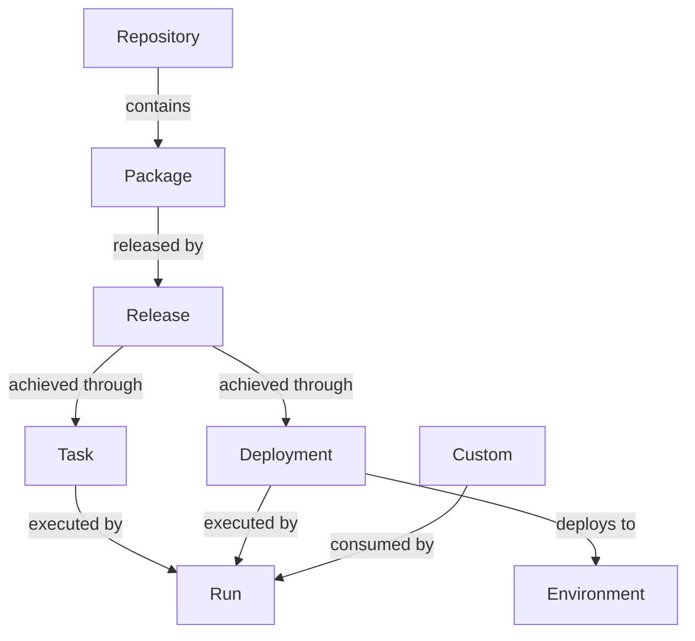

Ocuroot is a CI/CD orchestration tool that gives you more control over complex release pipelines.

Rather than designing DAGs, Ocuroot starts from higher level concepts like deployments and environments.
You can also configure your release process using imperative code for a high degree of flexibility.

* Need to deploy to many production environments to support varied customer needs?
* Got thousands of interrelated services and need them deployed in a particular order?
* Need detailed insight into what changes where deployed where and when?

Ocuroot has you covered!

## Key concepts

Core to Ocuroot are the concepts of *state* and *intent*. State represents the known, deployed state of your
applications and resources. Intent represents the desired state that you want Ocuroot to effect, allowing
GitOps-like workflows.

The following are represented in state:

* **Repositories** are Git repositories containing your source code
* **Packages** represent resources or services that can be deployed. They are defined by Ocuroot config files.
* **Releases** are snapshots of packages at a particular commit. They track the process of building, testing and deploying the package according to your configuration.
* **Environments** define locations where releases are deployed
* **Tasks** are scripted work to be executed as part of a release, defined by Starlark functions.
* **Deployments** are a special kind of Task to deploy a release to a specific environment. They are defined by two functions, an "up" function to deploy the release, and a "down" function to remove it from the environment.
* **Runs** are a single execution of a Task, which have a result and logs.
* **Custom State** allows you to pass data into releases and deployments without having to modify code

Environments, Deployments and Custom State have intent equivalents so they can be manually modified.
Releases are entirely managed by Ocuroot based on the contents of your source repo.

## Architecture

@ArchitectureDiagram

Ocuroot runs on top of your existing CI platform (GitHub Actions, Jenkins, CircleCI, BuildKite, etc.) and maintains
its own state store to track what has been deployed where and when.

The Ocuroot client, armed with its understanding of intent, history and the shape of your deployments, works in tandem
with your CI platform to perform exactly the right action at the right time.

