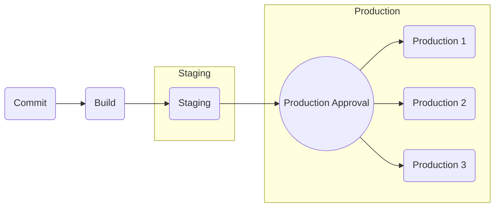
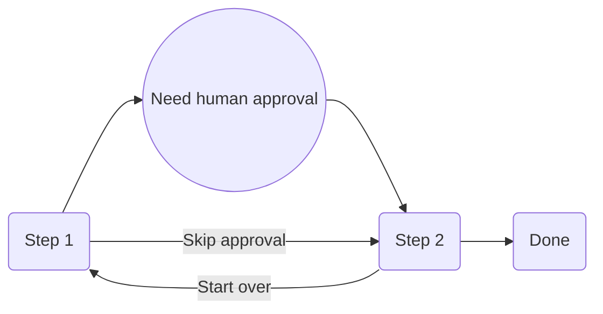
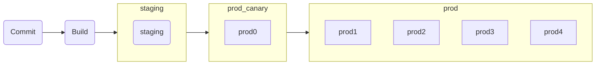
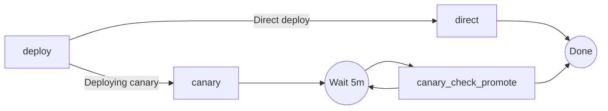

I've previously written about [defining deployment workflows using imperative code](/blog/breaking-out-of-yaml-for-cicd), and some challenges of [pre-rendering pipelines](/blog/07-enabling-pipeline-visualization) in a meaningful way.
Existing versions of the Ocuroot SDK have enabled simple workflows, and managed complex relationships between packages through dependencies. But there were still some important capabilities missing, like the ability to test a deployed
instance after a delay, or requiring manual approval before proceeding with a deployment. 

For the upcoming v0.3 release of the Ocuroot SDK, I've taken a step back and found some alternative ways of defining the flow of a release that strikes a better balance between power and predictability.

The changes boil down to a few key principles.

**Separating the flow of a release from the deployment of packages**. The flow of a release, such as deploying to staging before production, is only really relevant once for each build. But there may be many reasons you need to re-deploy
a known good build, or even tear down the current deployment. So we need to ensure deployments are effectively decoupled from the release process after this first run.

**Declaring the overall flow of a release up-front**. Related to the principle above, the release flow can usually be declared based only on the set of available environments. This means it can be defined up-front and rendered in a stable, meaningful way.
Having this up-front definition in turn makes it easier to predict the next steps in a release without having to repeatedly re-evaluate a `policy` function.

**Splitting deployment execution across multiple functions**. Sometimes, a deployment cannot be completed in one shot. You may want a member of your team to manually approve promotion of a build to a specific environment. 
In a more automated rollout, you may want to allow a deployment to run for a while, then check telemetry before declaring it "done".
You may even need to run some parts of a deployment on a different OS.
For all of these reasons, there needs to be a way to split execution of a deployment into multiple parts, each scheduled appropriately.

## The release function

The `release` function replaces the `policy` function from previous versions of the Ocuroot SDK.
The intention of this function is to build a flow of release "phases" associated with known environments.

It looks something like this:

```python
def release(environments):
    phases = [
        # Deploy all staging environments first
        phase(
            name="staging",
            environments=[x for x in environments if x.attributes["type"] == "staging"],
        ),
        # Deploy production environments after staging
        phase(
            name="prod",
            environments=[x for x in environments if x.attributes["type"] == "prod"],
            depends_on=["staging"],
        ),
    ]
    return phases
```

This approach batches multiple environments into individual phases, making it easier to reason about the flow of the
release process. It also separates this flow from the deployment logic itself, giving you flexibility to reuse a
release flow across multiple packages.

Grouping environments into phases also unlocks collective operations like approving production deployments in bulk.

```python
phase(
    name="prod",
    environments=[x for x in environments if x.attributes["type"] == "prod"],
    depends_on=["staging"],
    pre=approve_prod,
)
```

Putting this all together, a simple phased release flow could have structure like this:



## Function chaining

Deploying to a particular environment in itself can need complex workflows, some of them even involving cycles!
To support this, v0.3 introduces the concept of "handoff" between functions.

A "handoff" is a call that specifies the function that will take control of the deployment process, and any criteria for executing it.

For example:

```python
def step1():
  if needs_approval():
    return approval(step2, annotation="Need human approval")

  return handoff(step2, annotation="Skip approval")

def step2():
  if should_start_over():
    return handoff(step1, annotation="Start over")
  
  return done()
```

This is a slightly contrived example, but illustrates a two-step process with an approval check and a cycle.



This will enable the key missing concepts of human approvals, non-blocking delays and deployments involving multiple machines.
Not only that, but through static analysis, it is possible to draw a graph of this flow without executing the deployment.
Being able to visualize the flow beforehand will be a useful tool for validating Ocuroot config code, as well as a way to show
the state of a deployment clearly. 

## Example: Canary Deployment

Let’s look at how these features come together in a canary deployment! We'll start by defining a set of environments.

```python
environment("staging", {"type": "staging"})
for i in range(0, 5):
    environment("prod{}".format(i), {"type": "prod", "canary": str(i==0)})
```

We'll be working with a single staging environment, and five production environments, with one of them marked to run a
canary deploy. Only one of our production environments will run a canary, acting as a test before a more rapid rollout 
to other production environments.

Next, we'll define a release function to set up our phases.

```python
def release(environments):
    staging_envs = [x for x in environments if x.attributes["type"] == "staging"]
    prod_envs = [x for x in environments if x.attributes["type"] == "prod"]
    phases = [
        phase(
            name="staging",
            environments=staging_envs,
        ),
        phase(
            name="prod_canary",
            environments=[x for x in prod_envs if x.attributes.get("canary", "False") == "True"],
            depends_on=["staging"],
        ),
        phase(
            name="prod",
            environments=[x for x in prod_envs if x.attributes.get("canary", "False") == "False"],
            depends_on=["prod_canary"],
        ),
    ]
    return phases
```

This creates three phases, one for staging, one for prod with canaries, and one to mop up the rest of the production environments. This can be illustrated as:



Now we need to define the deployment process. This is where our handoff functions come in.

```python
# deploy is the entrypoint to a deployment for this package
def deploy(build, environment):
    # if this build has never been deployed, and this is a canary environment, deploy the canary
    # to verify the build
    if is_first_deployment(build, environment) and environment.attributes.get("canary", "False") == "True":
        return handoff(canary, annotation="Deploying canary")
    
    # otherwise, deploy directly
    return handoff(direct, annotation="Direct deploy")

# canary deploys the build as a canary and kicks off a monitoring process
def canary(build, environment):
    canary_id = do_deploy_canary(build, environment)

    return wait(canary_check_promote, delay="5m", memo={"check_count": 1, "canary_id": canary_id})

# canary_check_promote monitors the canary for 30 minutes, then promotes it to production
# if the telemetry continuously shows the canary is healthy
def canary_check_promote(build, environment, memo):
    # Ensure the canary is healthy
    if not check_canary_telemetry(memo["canary_id"]):
      revert_canary(environment, memo["canary_id"])
      return abort("Canary failed")

    # Check in increments of 5 minutes until 30 minutes have passed
    if memo["check_count"] < 6:
      return wait(canary_check_promote, delay="5m", memo={"check_count": memo["check_count"] + 1})

    # Promote the verified canary    
    promote_canary(environment, memo["canary_id"])

    return done()

# direct deploys the build directly to this environment
def direct(build, environment):
    deploy_directly(build, environment)
    return done()
```

This produces a workflow like the below:



So now we have a deployment workflow that determines if a canary is required, and if so, monitors a deployed canary instance for 30 minutes before promoting it to production. Repeating checks every 5 minutes also gives faster feedback if something goes wrong.

You could also include manual approval in this workflow, or replace the loop of checks with a webhook so an alert on the
canary could trigger the deployment to fail.

## Summary

This new SDK model will unlock a wealth of sophisticated deployment strategies, making it easier to build and maintain safe, auditable, and flexible delivery pipelines.

The iteration work will continue, so the final v0.3 SDK may have a few more changes to come, so be sure to stay tuned for updates, more examples and full documentation.