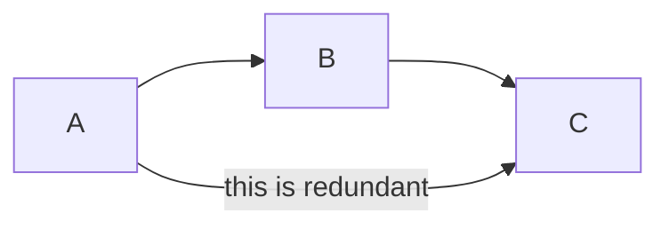
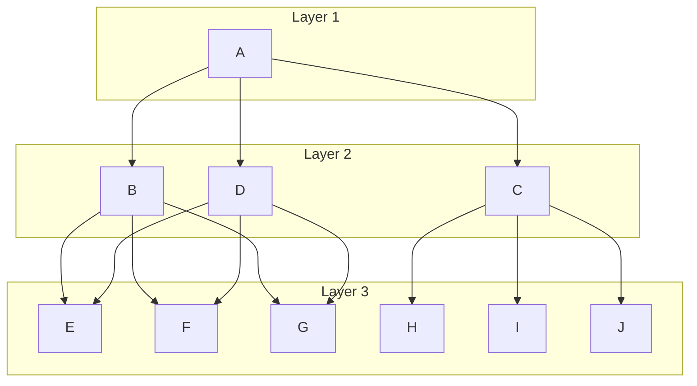

Last month, I [previewed the upcoming Ocuroot SDK v0.3](/blog/ocuroot-sdk-v0-3-canaries), highlighting some of the exciting new capabilities like function chaining and non-blocking delays. Since then, I've been refining the design based on further testing and community feedback.

Today I want to share some subtle but powerful improvements I've made to the package definition system that weren't fully fleshed out in my previous post. These changes might seem small on the surface, but they'll make a significant difference in both readability and flexibility.

## Ordered phases instead of dependency graphs

The most visible change is how we handle phase sequencing. In my preview, I showed phases with explicit dependencies:

```python
def release(environments):
    phases = [
        phase(
            name="staging",
            environments=staging_envs,
        ),
        phase(
            name="prod_canary",
            environments=[x for x in prod_envs if x.attributes.get("canary", "False") == "True"],
            depends_on=["staging"],
        ),
        phase(
            name="prod",
            environments=[x for x in prod_envs if x.attributes.get("canary", "False") == "False"],
            depends_on=["prod_canary"],
        ),
    ]
    return phases
```

While this seemed like it gave additional flexibility, all the examples I created
ended up boiling down to strict phase ordering. In fact, I often found myself adding
dependencies that duplicated transitive relationships.



While this could make sense in terms of the actual dependencies, it really only added complexity, making the graph harder to interpret.
When looking into ways of rendering these complex graphs, I came across the concept of [layered graph drawing](https://en.wikipedia.org/wiki/Layered_graph_drawing), breaking down a directed graph into a series of layers with edges flowing from one
layer to the next.



When you apply this process, there is a representation of any DAG as a
series of phases executing parallel work items. So we can write our phases in code
as such an ordered list.

```python
def release(environments):
    phases = [
        # Phases run in sequential order - no need for depends_on
        phase(
            name="staging",
            work=[
                # ...
            ],
        ),
        phase(
            name="prod_canary",
            work=[
                # ...
            ],
        ),
        phase(
            name="prod",
            work=[
                # ...
            ],
        ),
    ]
    return phases
```

This ordered approach makes the pipeline flow immediately apparent just by reading the phases from top to bottom. There's no need to mentally construct a dependency graph - the execution order is the same as the definition order. In my testing, this made complex pipelines much easier to understand at a glance.

And if you really, really want to build a dependency graph, you can still do so by
writing a function to structure your graph into phases.

## Direct work specification instead of environment lists

Another important change is how we define what happens in each phase. In my previous post, I showed phases that only contained environment lists:

```python
phase(
    name="staging",
    environments=staging_envs,
)
```

This approach required a separate deploy function to determine what to do with these environments. I've now made this more direct by specifying deployment in full in each phase:

```python
phase(
    name="staging",
    work=[deploy(up=_deploy_app, down=_teardown_app, environment=staging)],
)
```

The `work` parameter accepts a list of actions to perform, giving you much more flexibility:

1. As before, you can deploy to multiple environments in a single phase
2. You construct a phase from non-deployment work
3. You can mix different types of actions in a single phase

For example, a phase can now include both deployments and function calls:

```python
phase(
    name="staging",
    work=[
        deploy(up=_deploy_app, down=_teardown_app, environment=staging_env),
        call("validate", _validate_production_config),
    ],
)
```

This direct approach will help cut down on some boilerplate code and allow for more basic examples to be more compact and readable.

You may also recall that there was the option of providing a `pre` and `post` function for each phase to handle things like approval gates and batch tests. The changes to the model would require these to be implemented as separate phases, which does add a little boilerplate, but simplifies the overall mental model for a release.

## No separate build function requirement

In the previous SDK versions, there was always a special `build` function that created artifacts to be deployed. This was a fixed part of the pipeline structure. In real-world scenarios, I found this too limiting - sometimes you need to create different artifacts for different environments, or you need to build multiple things throughout the release process.

With the new system, there's no special build function. Instead, any phase can produce artifacts:

```python
phase(
    name="backend",
    work=[call("build",_build_backend_code)],
),
phase(
    name="deploy_staging",
    work=[deploy(
        environment=staging_env,
        up="deploy_backend",
        inputs=inputs(
            artifact=input_dep("artifact", work="build", phase="backend")
        ),
    )],
),
phase(
    name="frontend",
    work=[call("build",_build_frontend_with_staging_config)],
),
phase(
    name="test_integrated",
    work=[call("test",_run_e2e_tests)],
),
```

Notice how we have a build phase, then a deployment, then another build phase. This flexibility allows for much more realistic workflows where you might need to:

- Build different artifacts at different points in the pipeline
- Create a parallel matrix build for different platforms
- Configure your container registry as its own package that other packages can push to

## What's next?

I'm in the final stages of preparing the SDK v0.3 release. My aim is to share an
example client that you can try out very soon. In the meantime, you can follow
Ocuroot on [LinkedIn](https://www.linkedin.com/company/ocuroot), [BlueSky](https://bsky.app/profile/ocuroot.com) or get in touch directly by booking a [demo](/demo).
