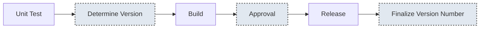

While preparing releases for the new Ocuroot binary, I needed to come up with a versioning strategy. When working
with [GitHub releases](https://docs.github.com/en/repositories/releasing-projects-on-github/about-releases) and 
tools like [GoReleaser](https://goreleaser.com/), it's customary to use Git tags to identify releases.

In the past, I've applied these tags manually, which came with a few challenges. I'd regularly re-apply an old
version number accidentally, or forget to push the tags. I wanted a more automated solution. Luckily, I'm building
a CI tool! So in keeping with the theme of using [Ocuroot to deploy Ocuroot](https://www.ocuroot.com/blog/01-deploying-ocuroot-with-ocuroot), I set about building versioning code with the v0.3.0 SDK.

## The strategy

[Semantic versioning](https://semver.org/) is something of a standard for representing software versions. Stable
releases are represented by a three part number major.minor.patch (e.g.: `1.2.3`). I also want to be able to label
builds that aren't ready for a public release. Semver provides the concept of a pre-release value after the stable
number, like `1.2.3-alpha1` or `1.2.3-rc`. To keep things simple, I'm going to use a single number to track the
pre-release builds, which is permitted via the spec.

For the automated part of the process, I'm going to focus on the patch and pre-release numbers. The pre-release number
will increase with every build, and the patch number will only increase when releasing a build publicly. So a sequence
of releases may end up with these version numbers:

* `0.3.0-1` -> `0.3.0`
* `0.3.1-1`
* `0.3.1-2`
* `0.3.1-3` -> `0.3.1`
* `0.3.2-1`

Where the arrow represents a build being approved to be released publicly, generating a stable release number.

This leaves the major and minor version numbers, which can be set manually ahead of time and stored in the source tree.
To handle changes in these values, the versioning code will need to reset the patch and pre-release numbers if the major
or minor versions change.

## Implementation

Now we're ready to start writing a release config! In the root of the Ocuroot repo, I created a file called `release.ocu.star` and set about fleshing out the versioning code.

A simple binary release would consist of separate phases to test, build and release. To control the versioning, we'll
add an approval phase before the release, and add separate phases for determining the version numbers.

Ordinarily you might integrate steps for versioning into other phases, but for this illustration, we'll keep them separate to avoid boilerplate.



We need to be able to parse release numbers to work with them, so I wrote a quick-and-dirty function to convert a version
string to a struct:

```python
def version_to_struct(version):
    prerelease = "0"
    if version.find("-") != -1:
        prerelease = version.split("-")[1]
        version = version.split("-")[0]

    return struct(
        major=int(version.split(".")[0]),
        minor=int(version.split(".")[1]),
        patch=int(version.split(".")[2]),
        prerelease=int(prerelease),
    )
```

Next, we need to be able to increment the version numbers appropriately based on the most recent pre-release and stable
version numbers:

```python
def next_prerelease_version(prerelease, version):
    mm = "{}.{}.".format(MAJOR, MINOR)
    # First patch sand prerelease for this major/minor version
    if prerelease == "" or not prerelease.startswith(mm):
        return "{}.{}.{}-1".format(MAJOR, MINOR, 0)

    if not version.startswith(mm):
        version = ""

    ps = version_to_struct(prerelease)

    if version != "":
        vs = version_to_struct(version)
        # Next patch for this major/minor version
        if vs.patch == ps.patch:
            return "{}.{}.{}-1".format(MAJOR, MINOR, vs.patch + 1)
    
    # Next prerelease for this major/minor version
    return "{}.{}.{}-{}".format(MAJOR, MINOR, ps.patch, ps.prerelease + 1)
```

For this example, `MAJOR` and `MINOR` are stored in global variables.

Now we can start creating our phases. First, up, let's add a phase that obtains the previous numbers and calculates the
next ones:

```python
# ... Unit test phase here ...

def version(ctx):
    prerelease = next_prerelease_version(ctx.inputs.prev_prerelease, ctx.inputs.prev_version)
    return done(
        outputs={
            "prerelease": prerelease,
        },
        tags=[prerelease],
    )

phase(
    name="version",
    work=[call(
        version, 
        name="version", 
        inputs={
            "prev_prerelease": input(ref="./@/call/version#output/prerelease", default=""),
            "prev_version": input(ref="./@/call/finalize#output/version", default=""),
        },
    )],
)

# ... Build phase here ...
```

Here the `version` function gets the previous prerelease version from the last successful run of the `version` function
and the previous stable version from the last successful run of the `finalize` function. It then calculates the next
prerelease version and returns it as an output. The release is also tagged with this version in Ocuroot state to make
it easy to find and work with later.

After the build phase, we want to introduce a human approval to promote a stable release. We'll do this by using a custom value
in the state store:

```python
# ... Build phase here ...

promotion_ref = ref("./custom/promote")

phase(
    name="promote",
    work=[call(
        noop, 
        name="promote", 
        inputs={
            "approval": input(
                ref=promotion_ref,
            ),

        }    
    )],
)

# ... Release phase here ...
```

The `promotion_ref` value refers to a custom value called `promote` in this release. The input also has documentation
provided with instructions on how to manually approve the release.

For a tagged pre-release version `0.1.0-1`, you could call `ocuroot state set "versioning/-/release.ocu.star/+0.1.0-1/custom/promote" 1` to promote the build and trigger the release phase.

```python
# ... Release phase here ...

def finalize(ctx):
    version = ctx.inputs.prerelease.split("-")[0]
    return done(
        outputs={
            "version": version,
        },
        tags=[version],
    )

phase(
    name="finalize",
    work=[
        call(
            finalize,
            name="finalize",
            inputs={
                "version": input(ref="./@/call/version#output/version"),
            },
        ),
    ],
)
```

Once a release has succeeded, our finalize phase marks that version as the current version for this package and tags the release as we did before for the
pre-release version.

With clear version numbers available, the build and release steps can apply Git tags, select paths for storing artifacts and perform any other tasks that
might require a valid version number. Even better, I don't need to think about tracking the patch and pre-release version numbers manually!

## What's next?

I'm in the final stages of preparing the SDK v0.3 release. My aim is to share a version that you can try out very soon. In the meantime, you can follow
Ocuroot on [LinkedIn](https://www.linkedin.com/company/ocuroot), [BlueSky](https://bsky.app/profile/ocuroot.com) or get in touch directly by booking a [demo](/demo).